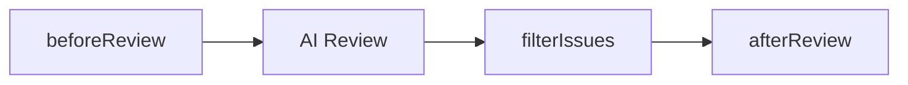

# Stargazer Cheat Sheet

> Single-page quick reference for implementing Stargazer.

---

## Quick Setup

```bash
# Install dependencies
pnpm add @google/genai zod

# Set API key
export GEMINI_API_KEY=your-key-here
```

---

## Core Patterns

### Result Type

```typescript
import { ok, err } from './shared/result';
import type { Result, ApiError } from './shared/result';

// Definition
type Result<T, E = ApiError> =
  | { readonly ok: true; readonly data: T }
  | { readonly ok: false; readonly error: E };

// Helpers
const ok = <T>(data: T) => ({ ok: true, data });
const err = <E>(error: E) => ({ ok: false, error });

// Usage
async function doSomething(): Promise<Result<Data>> {
  if (failed) return err({ code: 'API_ERROR', message: 'Failed' });
  return ok(data);
}

const result = await doSomething();
if (!result.ok) return; // Handle error
console.log(result.data); // TypeScript knows this is Data
```

### Factory Functions

```typescript
// Pattern: createX() returns interface
function createGeminiClient(apiKey: string): GeminiClient {
  const client = new GoogleGenAI({ apiKey }); // Private via closure

  return {
    generate: async (prompt, schema) => { ... },
    countTokens: async (content) => { ... },
  };
}

// Usage
const gemini = createGeminiClient(apiKey);
const result = await gemini.generate(prompt, Schema);
```

### Zod Schemas

```typescript
import * as z from 'zod/v4';

// Define schema with .describe() on ALL fields
const IssueSchema = z.object({
  id: z.string().describe('Unique identifier'),
  file: z.string().describe('File path'),
  line: z.int().positive().describe('Line number'), // z.int() not z.number()
  severity: z.enum(['critical', 'high', 'medium', 'low']).describe('Severity'),
  message: z.string().describe('Issue description'),
}).describe('A code review issue');

// Infer TypeScript type
type Issue = z.infer<typeof IssueSchema>;

// Convert to JSON Schema for Gemini
const jsonSchema = z.toJSONSchema(IssueSchema, { target: 'openapi-3.0' });
```

### Gemini API Call

```typescript
import { GoogleGenAI } from '@google/genai';
import * as z from 'zod/v4';

const client = new GoogleGenAI({ apiKey });

const response = await client.models.generateContent({
  model: 'gemini-2.0-flash',
  contents: prompt,
  config: {
    responseMimeType: 'application/json',
    responseJsonSchema: z.toJSONSchema(Schema, { target: 'openapi-3.0' }),
    temperature: 0.2,
  },
});

// Always validate response
const parsed = Schema.safeParse(JSON.parse(response.text ?? ''));
if (!parsed.success) return err({ code: 'SCHEMA_VALIDATION', message: parsed.error.message });
return ok(parsed.data);
```

---

## Import Patterns

```typescript
// ✅ CORRECT - Direct imports
import { ok, err } from '../shared/result';
import type { Result } from '../shared/result';
import { createGeminiClient } from '../gemini/client';
import type { GeminiClient } from '../gemini/types';
import { IssueSchema } from '../review/schemas';
import type { Issue } from '../review/types';

// ❌ WRONG - Barrel imports
import { ok, err, createGeminiClient } from '../shared';
```

---

## Key Schemas

### Issue

```typescript
const IssueSchema = z.object({
  id: z.string(),
  file: z.string(),
  line: z.int().positive(),
  endLine: z.int().positive().optional(),
  severity: z.enum(['critical', 'high', 'medium', 'low']),
  category: z.enum(['bug', 'security', 'convention', 'performance']),
  message: z.string(),
  suggestion: z.string().optional(),
  conventionRef: z.string().optional(),
  confidence: z.number().min(0).max(1),
});
```

### ReviewResult

```typescript
const ReviewResultSchema = z.object({
  summary: z.string(),
  decision: z.enum(['approve', 'request_changes', 'comment']),
  issues: z.array(IssueSchema),
  positives: z.array(z.string()).optional(),
});
```

### ProjectConventions

```typescript
const ProjectConventionsSchema = z.object({
  version: z.literal('1.0'),
  discoveredAt: z.string().datetime(),
  language: z.string(),
  patterns: z.object({
    errorHandling: ConventionPatternSchema.optional(),
    naming: ConventionPatternSchema.optional(),
    testing: ConventionPatternSchema.optional(),
    imports: ConventionPatternSchema.optional(),
  }),
  summary: z.string(),
});
```

---

## Error Codes

```typescript
type ErrorCode =
  | 'API_ERROR'           // Gemini API failed
  | 'SCHEMA_VALIDATION'   // Zod validation failed
  | 'CONFIG_INVALID'      // Bad configuration
  | 'GIT_ERROR'           // Git operation failed
  | 'RATE_LIMITED'        // 429 rate limit
  | 'UNAUTHORIZED'        // 401 bad API key
  | 'BAD_REQUEST'         // 400 bad request
  | 'EMPTY_RESPONSE'      // Empty API response
  | 'TIMEOUT'             // Request timeout
  | 'FILE_NOT_FOUND';     // File missing
```

---

## Plugin Hooks



```typescript
interface StargazerPlugin {
  readonly name: string;
  readonly beforeReview?: (ctx: ReviewContext) => ReviewContext;
  readonly afterReview?: (result: ReviewResult, ctx: ReviewContext) => ReviewResult;
  readonly filterIssues?: (issues: Issue[]) => Issue[];
  readonly beforeDiscovery?: (files: FileContext[]) => FileContext[];
  readonly afterDiscovery?: (conventions: ProjectConventions) => ProjectConventions;
}

// Example plugin
const ignorePathsPlugin: PluginFactory<{ paths: string[] }> = (options) => ({
  name: 'ignore-paths',
  filterIssues: (issues) =>
    issues.filter(i => !options?.paths.some(p => i.file.includes(p))),
});
```

---

## File Structure

```
packages/core/src/
├── index.ts                 # ONLY public barrel
├── shared/                  # NO index.ts!
│   ├── result.ts           # Result<T,E>, ok(), err()
│   └── types.ts            # Common types
├── gemini/                  # NO index.ts!
│   ├── client.ts           # createGeminiClient()
│   └── types.ts            # GeminiClient interface
├── review/                  # NO index.ts!
│   ├── engine.ts           # createReviewEngine()
│   ├── schemas.ts          # Zod schemas
│   └── types.ts            # ReviewResult, Issue
├── conventions/             # NO index.ts!
│   ├── discovery.ts        # discoverConventions()
│   └── cache.ts            # loadConventions()
├── plugins/                 # NO index.ts!
│   ├── hooks.ts            # runHooks()
│   └── types.ts            # StargazerPlugin
├── config/                  # NO index.ts!
│   ├── define.ts           # defineConfig()
│   └── resolve.ts          # resolveConfig()
└── stargazer.ts            # createStargazer() facade
```

---

## Quick Decisions

| Question | Answer |
|----------|--------|
| How to handle errors? | `Result<T, E>` - never throw |
| Classes or functions? | Factory functions `createX()` |
| Index files in folders? | NO - direct imports only |
| Zod import? | `import * as z from 'zod/v4'` |
| Gemini schema option? | `responseJsonSchema` |
| JSON Schema target? | `{ target: 'openapi-3.0' }` |
| Default exports? | NO - named exports only |
| `any` type? | NO - use `unknown` |
| `.then().catch()`? | NO - use async/await |
| Mutable interfaces? | NO - use `readonly` |

---

## Common Snippets

### Create Error

```typescript
const createError = (code: ErrorCode, message: string, cause?: unknown): ApiError =>
  ({ code, message, cause });
```

### Retry with Backoff

```typescript
async function withRetry<T>(
  fn: () => Promise<Result<T>>,
  maxRetries = 3,
  baseDelay = 1000
): Promise<Result<T>> {
  for (let i = 0; i < maxRetries; i++) {
    const result = await fn();
    if (result.ok || result.error.code !== 'RATE_LIMITED') return result;
    await new Promise(r => setTimeout(r, baseDelay * Math.pow(2, i)));
  }
  return fn();
}
```

### Validate Config

```typescript
const StargazerConfigSchema = z.object({
  apiKey: z.string().min(1, 'API key required'),
  model: z.enum(['gemini-2.0-flash', 'gemini-2.0-pro']).default('gemini-2.0-flash'),
  minSeverity: z.enum(['critical', 'high', 'medium', 'low']).default('high'),
  maxComments: z.number().int().positive().default(10),
});
```

---

## Links

- [Implementation Rules](./implementation-rules.md) - Full coding rules for AI agents
- [Architecture](./state-of-art-architecture.md) - Detailed architecture decisions
- [Plugins](./plugins.md) - Writing custom plugins
- [Quick Start](./quick-start.md) - Getting started guide
