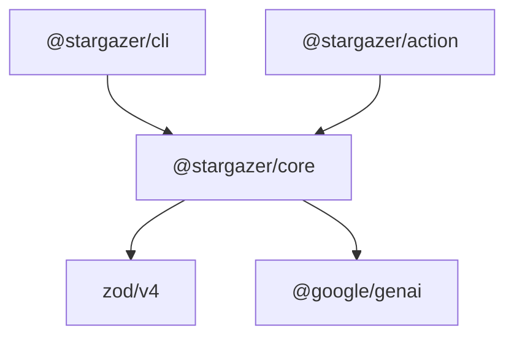
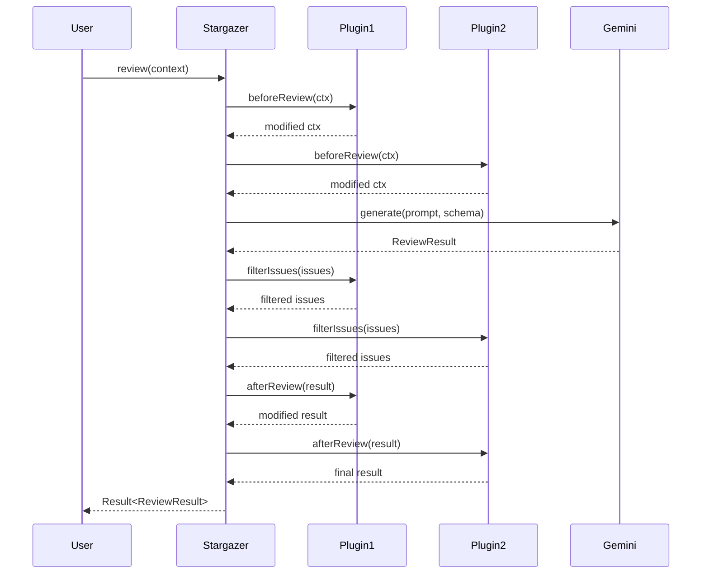

# Stargazer - State-of-the-Art Architecture

> **TL;DR**: Use `Result<T, E>` for errors (never throw), factory functions `createX()` (no classes),
> direct imports `'../shared/result'` (no barrels), Zod 4 with `z.toJSONSchema(schema, { target: 'openapi-3.0' })`.
> See [Implementation Rules](./implementation-rules.md) and [Cheat Sheet](./cheat-sheet.md) for quick reference.

## Executive Summary

Architecture refactored from class-based to **100% functional approach** with Tagged Unions, simple plugin system (Vite-style), and Zod 4.

| Aspect | Details |
|--------|---------|
| **Scope** | MVP for hackathon (Core + CLI + Action) |
| **License** | MIT open source |
| **Monetization** | Hosting-as-a-Service (future) |
| **Tech Stack** | TypeScript 5.x, Zod 4, @google/genai, pnpm + Turborepo |

---

## Key Architectural Decisions

| Decision | Choice | Rationale |
|----------|--------|-----------|
| Error handling | Tagged Unions (`Result<T, E>`) | No classes, TypeScript-native, explicit |
| Plugin system | Simple hooks (Vite-style) | Easy to contribute, covers 90% use cases |
| Validation | Zod 4 | Native `z.toJSONSchema()` with `target: 'openapi-3.0'` |
| State management | Closures | No classes, explicit dependencies |
| Module pattern | Factory functions | `createX()` returns interface object |
| Monorepo | pnpm + Turborepo + tsup | 2025 standard, fast builds |
| Module resolution | `bundler` mode | Clean imports without `.js` extensions |
| Module organization | **NO internal barrels** | Direct imports only, per TkDodo |

---

## 1. Error Handling Pattern (Tagged Unions)

### Problem with Classes
```typescript
// OLD (class-based) - DON'T DO THIS
class StargazerError extends Error {
  constructor(public code: string, message: string) { ... }
}
throw new StargazerError('API_ERROR', 'Failed');
```

### New Approach (Tagged Unions)
```typescript
// NEW (functional) - DO THIS
// packages/core/src/shared/result.ts

export type Result<T, E = StargazerError> =
  | { readonly ok: true; readonly data: T }
  | { readonly ok: false; readonly error: E };

export type StargazerError = {
  readonly code: ErrorCode;
  readonly message: string;
  readonly cause?: unknown;
};

export type ErrorCode =
  | 'API_ERROR'           // Gemini API call failed
  | 'SCHEMA_VALIDATION'   // Zod validation failed
  | 'CONFIG_INVALID'      // Invalid configuration
  | 'GIT_ERROR'           // Git operation failed
  | 'RATE_LIMITED'        // API rate limit hit (429)
  | 'UNAUTHORIZED'        // API key invalid (401)
  | 'BAD_REQUEST'         // Malformed request (400)
  | 'EMPTY_RESPONSE'      // API returned empty response
  | 'TIMEOUT'             // Request timed out
  | 'FILE_NOT_FOUND';     // File doesn't exist

// Helper functions
export const ok = <T>(data: T): Result<T, never> => ({ ok: true, data });
export const err = <E>(error: E): Result<never, E> => ({ ok: false, error });
export const isOk = <T, E>(r: Result<T, E>): r is { ok: true; data: T } => r.ok;
export const isErr = <T, E>(r: Result<T, E>): r is { ok: false; error: E } => !r.ok;
```

### Usage Example
```typescript
async function callGemini(): Promise<Result<ReviewResult>> {
  try {
    const response = await client.generateContent(...);
    return ok(response);
  } catch (e) {
    return err({ code: 'API_ERROR', message: String(e), cause: e });
  }
}

// Consumer - explicit handling
const result = await callGemini();
if (!result.ok) {
  console.error(result.error.message);
  return;
}
console.log(result.data); // TypeScript knows it's ReviewResult
```

---

## Visual Overview

### Data Flow (PR Review)


### Package Dependencies



### Plugin Hook Execution Order



---

## 2. Plugin System (Vite-Style Simple Hooks)

### Problem with Complex Systems
```typescript
// OLD (too complex) - DON'T DO THIS
interface Plugin {
  setup?: (context: PluginContext) => Promise<void>;
  rules?: RuleDefinition[];
  analyzers?: AnalyzerDefinition[];
  hooks?: Partial<PluginHooks>;
}
// + PluginRegistry + HookRunner + chains...
```

### New Approach (Vite-style)
```typescript
// NEW (simple) - DO THIS
// packages/core/src/plugins/types.ts

export interface StargazerPlugin {
  readonly name: string;

  // Optional hooks - just functions
  readonly beforeReview?: (ctx: ReviewContext) => ReviewContext | Promise<ReviewContext>;
  readonly afterReview?: (result: ReviewResult, ctx: ReviewContext) => ReviewResult | Promise<ReviewResult>;
  readonly filterIssues?: (issues: Issue[]) => Issue[];
  readonly beforeDiscovery?: (files: FileContext[]) => FileContext[];
  readonly afterDiscovery?: (conventions: ProjectConventions) => ProjectConventions;
}

// Plugin is just a function returning an object
export type PluginFactory<T = void> = (options?: T) => StargazerPlugin;
```

### Example Plugin
```typescript
export const ignorePathsPlugin: PluginFactory<{ paths: string[] }> = (options) => ({
  name: 'ignore-paths',
  filterIssues: (issues) =>
    issues.filter(i => !options?.paths.some(p => i.file.includes(p))),
});

// Usage in config
export default defineConfig({
  plugins: [
    ignorePathsPlugin({ paths: ['/legacy/', '/generated/'] }),
  ],
});
```

### Hook Runner (Simplified)
```typescript
// packages/core/src/plugins/hooks.ts

export async function runHooks<T>(
  plugins: StargazerPlugin[],
  hookName: keyof StargazerPlugin,
  initialValue: T,
  ...args: unknown[]
): Promise<T> {
  let result = initialValue;

  for (const plugin of plugins) {
    const hook = plugin[hookName] as Function | undefined;
    if (hook) {
      result = await hook(result, ...args);
    }
  }

  return result;
}
```

---

## 3. Zod 4 Integration

### Migration from Zod 3
```typescript
// OLD (Zod 3 + adapter) - DON'T DO THIS
import { z } from 'zod';
import { zodToJsonSchema } from 'zod-to-json-schema';
const schema = zodToJsonSchema(IssueSchema);

// NEW (Zod 4 native) - DO THIS
import * as z from 'zod/v4';

export const IssueSchema = z.object({
  id: z.string().describe('Unique identifier'),
  file: z.string().describe('File path'),
  line: z.int().positive().describe('Line number'),  // z.int() in Zod 4
  severity: z.enum(['critical', 'high', 'medium', 'low']),
  category: z.enum(['bug', 'security', 'convention', 'performance']),
  message: z.string().describe('Issue description'),
  suggestion: z.string().optional().describe('Suggested fix'),
  conventionRef: z.string().optional().describe('Reference to convention'),
  confidence: z.number().min(0).max(1).describe('Confidence 0-1'),
}).describe('A single code review issue');

// CRITICAL: Use OpenAPI 3.0 target for Gemini API compatibility
const jsonSchema = z.toJSONSchema(IssueSchema, { target: 'openapi-3.0' });
```

---

## 4. File Structure (NO Internal Barrels!)

**Research shows feature-based organization is state-of-the-art**, but with **NO internal barrel files** per [TkDodo's best practice](https://tkdodo.eu/blog/please-stop-using-barrel-files).

```
stargazer/
├── package.json                  # pnpm workspace root
├── pnpm-workspace.yaml
├── turbo.json
├── tsconfig.base.json
├── LICENSE                       # MIT
├── README.md
│
├── packages/
│   │
│   ├── core/                     # @stargazer/core
│   │   ├── package.json
│   │   ├── tsup.config.ts
│   │   ├── tsconfig.json
│   │   └── src/
│   │       ├── index.ts          # ONLY PUBLIC BARREL
│   │       │
│   │       ├── shared/           # NO index.ts!
│   │       │   ├── result.ts     # Result<T,E>, ok(), err()
│   │       │   ├── types.ts      # Logger, common types
│   │       │   └── errors.ts     # ErrorCode type
│   │       │
│   │       ├── gemini/           # NO index.ts!
│   │       │   ├── client.ts     # createGeminiClient()
│   │       │   ├── models.ts     # MODELS constant
│   │       │   └── types.ts      # GeminiClient interface
│   │       │
│   │       ├── review/           # NO index.ts!
│   │       │   ├── engine.ts     # createReviewEngine()
│   │       │   ├── filter.ts     # filterIssues()
│   │       │   ├── prompts.ts    # buildReviewPrompt()
│   │       │   ├── types.ts      # ReviewResult, Issue
│   │       │   └── schemas.ts    # Zod schemas
│   │       │
│   │       ├── conventions/      # NO index.ts!
│   │       │   ├── discovery.ts  # discoverConventions()
│   │       │   ├── cache.ts      # loadConventions()
│   │       │   ├── types.ts      # ProjectConventions
│   │       │   └── schemas.ts    # Zod schemas
│   │       │
│   │       ├── context/          # NO index.ts!
│   │       │   ├── selector.ts   # selectContext()
│   │       │   ├── git.ts        # getDiff()
│   │       │   └── types.ts      # FileContext
│   │       │
│   │       ├── plugins/          # NO index.ts!
│   │       │   ├── hooks.ts      # runHooks()
│   │       │   └── types.ts      # StargazerPlugin
│   │       │
│   │       ├── config/           # NO index.ts!
│   │       │   ├── define.ts     # defineConfig()
│   │       │   ├── resolve.ts    # resolveConfig()
│   │       │   ├── defaults.ts   # DEFAULT_CONFIG
│   │       │   └── types.ts      # StargazerConfig
│   │       │
│   │       └── stargazer.ts      # createStargazer() facade
│   │
│   ├── cli/                      # @stargazer/cli
│   │   └── src/
│   │       ├── index.ts          # CLI entry
│   │       ├── commands/         # NO index.ts!
│   │       │   ├── review.ts
│   │       │   ├── discover.ts
│   │       │   └── init.ts
│   │       └── output/           # NO index.ts!
│   │           ├── terminal.ts
│   │           ├── json.ts
│   │           └── markdown.ts
│   │
│   └── action/                   # @stargazer/action
│       └── src/
│           ├── index.ts          # Action entry
│           ├── handlers/         # NO index.ts!
│           │   ├── pr.ts
│           │   └── comment.ts
│           └── github/           # NO index.ts!
│               ├── client.ts
│               ├── review.ts
│               └── diff.ts
│
└── docs/
    ├── en/                       # English documentation
    └── pl/                       # Polish documentation
```

### Import Rules

```typescript
// CORRECT - direct imports
import { ok, err } from '../shared/result';
import type { GeminiClient } from '../gemini/types';
import { createReviewEngine } from '../review/engine';

// WRONG - barrel imports (DON'T DO THIS!)
import { ok, err, GeminiClient } from '../shared';
import { createReviewEngine } from '../review';
```

**Why no internal barrels?**
- Eliminates circular import risks
- Better tree shaking (68% fewer loaded modules)
- Faster TypeScript compilation
- Clearer dependency graph

---

## 5. Gemini Client (Functional Pattern)

```typescript
// packages/core/src/gemini/client.ts

import { GoogleGenAI, ApiError } from '@google/genai';
import * as z from 'zod/v4';
import { ok, err } from '../shared/result';       // direct import!
import type { Result } from '../shared/result';
import type { GeminiClient, GenerateOptions } from './types';

export function createGeminiClient(
  apiKey: string,
  defaultModel = 'gemini-2.0-flash'
): GeminiClient {
  const client = new GoogleGenAI({ apiKey });

  return {
    async generate<T extends z.ZodType>(
      prompt: string,
      schema: T,
      options?: GenerateOptions
    ): Promise<Result<z.infer<T>>> {
      try {
        const response = await client.models.generateContent({
          model: options?.model ?? defaultModel,
          contents: prompt,
          config: {
            responseMimeType: 'application/json',
            // CRITICAL: Use responseJsonSchema with OpenAPI 3.0 target
            responseJsonSchema: z.toJSONSchema(schema, { target: 'openapi-3.0' }),
            temperature: options?.temperature ?? 0.2,
          },
        });

        const parsed = schema.safeParse(JSON.parse(response.text ?? ''));
        if (!parsed.success) {
          return err({ code: 'SCHEMA_VALIDATION', message: parsed.error.message });
        }
        return ok(parsed.data);
      } catch (e) {
        if (e instanceof ApiError && e.status === 429) {
          return err({ code: 'RATE_LIMITED', message: e.message, cause: e });
        }
        return err({ code: 'API_ERROR', message: String(e), cause: e });
      }
    },

    async countTokens(content: string): Promise<number> {
      const response = await client.models.countTokens({
        model: defaultModel,
        contents: content,
      });
      return response.totalTokens ?? 0;
    },
  };
}
```

### Retry Logic with Exponential Backoff

For handling rate limits gracefully:

```typescript
// packages/core/src/shared/retry.ts

const sleep = (ms: number) => new Promise(resolve => setTimeout(resolve, ms));

export async function withRetry<T>(
  fn: () => Promise<Result<T>>,
  options: {
    maxRetries?: number;
    baseDelay?: number;
    shouldRetry?: (error: StargazerError) => boolean;
  } = {}
): Promise<Result<T>> {
  const {
    maxRetries = 3,
    baseDelay = 1000,
    shouldRetry = (e) => e.code === 'RATE_LIMITED',
  } = options;

  for (let attempt = 0; attempt < maxRetries; attempt++) {
    const result = await fn();

    // Success or non-retryable error
    if (result.ok || !shouldRetry(result.error)) {
      return result;
    }

    // Wait with exponential backoff before retry
    const delay = baseDelay * Math.pow(2, attempt);
    await sleep(delay);
  }

  // Final attempt
  return fn();
}

// Usage
const result = await withRetry(
  () => geminiClient.generate(prompt, Schema),
  { maxRetries: 3, baseDelay: 1000 }
);
```

---

## 6. TypeScript Configuration (Bundler Mode)

```json
{
  "$schema": "https://json.schemastore.org/tsconfig",
  "compilerOptions": {
    "module": "ESNext",
    "moduleResolution": "bundler",
    "target": "ES2022",

    "strict": true,
    "noUncheckedIndexedAccess": true,
    "noImplicitOverride": true,

    "esModuleInterop": true,
    "skipLibCheck": true,
    "resolveJsonModule": true,
    "isolatedModules": true,
    "verbatimModuleSyntax": true,

    "declaration": true,
    "declarationMap": true,

    "noEmit": true
  }
}
```

**Benefits of bundler mode:**
- Clean imports without `.js` extensions
- TypeScript only type-checks, tsup handles bundling
- Dual ESM/CJS output for compatibility

---

## 7. Public API (Only Barrel)

```typescript
// packages/core/src/index.ts
// ONLY PUBLIC BARREL - direct imports from specific files

// Result type
export { ok, err, isOk, isErr } from './shared/result';
export type { Result, StargazerError, ErrorCode } from './shared/result';

// Review
export type { ReviewResult, Issue, IssueSeverity } from './review/types';
export { IssueSchema, ReviewResultSchema } from './review/schemas';
export { createReviewEngine } from './review/engine';

// Conventions
export type { ProjectConventions } from './conventions/types';
export { discoverConventions } from './conventions/discovery';
export { loadConventions, saveConventions } from './conventions/cache';

// Plugins (Vite-style)
export type { StargazerPlugin, PluginFactory } from './plugins/types';
export { runHooks } from './plugins/hooks';

// Config
export type { StargazerConfig, ResolvedConfig } from './config/types';
export { defineConfig } from './config/define';

// Gemini client
export { createGeminiClient } from './gemini/client';
export type { GeminiClient } from './gemini/types';

// Main facade
export { createStargazer } from './stargazer';
export type { Stargazer, StargazerOptions } from './stargazer';
```

---

## 8. Key Differences from Previous Architecture

| Previous | New |
|----------|-----|
| `class StargazerError extends Error` | `type StargazerError = { code, message, cause }` |
| `class GeminiClient` | `createGeminiClient()` factory function |
| `class Stargazer` | `createStargazer()` factory function |
| Internal barrels (`index.ts` in folders) | NO internal barrels - direct imports only |
| `responseSchema` for Gemini | `responseJsonSchema` with OpenAPI 3.0 target |
| `z.toJSONSchema(schema)` | `z.toJSONSchema(schema, { target: 'openapi-3.0' })` |
| Complex PluginRegistry | Simple Vite-style hooks |
| `.js` extensions in imports | Clean imports (bundler mode) |
| `import { z } from 'zod'` | `import * as z from 'zod/v4'` |

---

## Sources

### Architecture & Patterns
- [TkDodo - Please Stop Using Barrel Files](https://tkdodo.eu/blog/please-stop-using-barrel-files)
- [Vite Plugin API](https://vite.dev/guide/api-plugin)
- [TypeScript Result Types](https://typescript.tv/best-practices/error-handling-with-result-types/)

### Build & Tooling
- [Turborepo - Structuring Repository](https://turborepo.com/docs/crafting-your-repository/structuring-a-repository)
- [TypeScript Bundler Mode](https://www.typescriptlang.org/tsconfig/moduleResolution.html)

### APIs & Libraries
- [Zod 4 JSON Schema](https://zod.dev/json-schema)
- [Gemini API Structured Outputs](https://ai.google.dev/gemini-api/docs/structured-output)
- [Google GenAI JS SDK](https://github.com/googleapis/js-genai)
